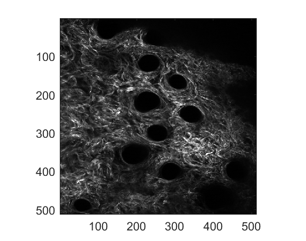

# calcfibang2D

Calculates a 2D fiber orientation map

---

## Syntax

`orientImage = calcfibang2D(img, kernelSize, filt_on)`

---

## Description

[orientImage](#orientimage) = calcfibang2D([img](#img), [kernelSize](#kernelsize), [filt_on](#filt_on)) returns the pixel-wise 2D fiber orientation map (orientImage) for an input image (image) based on differences in a local area, dictated by kernelSize. The input image can also be blurred during function execution via the filt_on input.

---

## Examples

## **Analysis of collagen SHG image**

Load and display the image

```matlab
shgim = imread('./documentation/calcfibang2D/SHG Intensity Image.tif');
figure; imagesc(shgim); colormap gray;
axis image;
```



Calculate the pixel-wise intensity-based fiber orientation with a kernel size of 7 pixels and no filtering

```matlab
orientImg = calcfibang2D(shgim,7,0);
figure; imagesc(orientImg,'AlphaData',single(shgim)./8191); colormap hsv;
caxis([-pi/2 pi/2]); % Adjust color limits (if necessary)
axis image; colorbar;
set(gca,'Color',[0 0 0]); % Set background color to black
```


Create a simple collagen-positive mask based on the intensity

```matlab
shgMask = (shgim > 1000);
figure; imagesc(shgMask);
axis image;
```


Calculate a map of local directional variance with an 21 x 21 pixel square

```matlab
dv = directionalVariance2D(orientImg,shgMask,10);
% Display local DV map
figure; imagesc(dv,'AlphaData',single(shgim)./8191); colormap jet;
caxis([0 1])
axis image; colorbar;
set(gca,'Color',[0 0 0]);
```


---

## Input Arguments

## img

The input intensity image, which does not have to be normalized, where pixel-wise fiber orientations will be calculated.

*Data types: `uint8` | `uint16` | `uint32`*

## kernelSize

The size of the local area that will be used to calculate the fiber orientation. The window size will be $[2*kernelSize + 1, 2*kernelSize + 1]$ pixels wide.

*Data types: `single` | `double`*

## filt_on

Logical true or false value for specifying if gaussian blur filter is desired.

*Data types: `logical`*

---

## Output Arguments

## orientImage

Pixel-wise map of calculated fiber orientation. Fiber orientations will range between [-π/2 π/2].

*Data types: `single` | `double`*

---

## More About

## *Weighted vector summation algorithm*

For more information on the algorithm used, please read the published article found [here](https://doi.org/10.1117/1.JBO.18.4.046003).

---

## [Return to top](#calcfibang2d)
