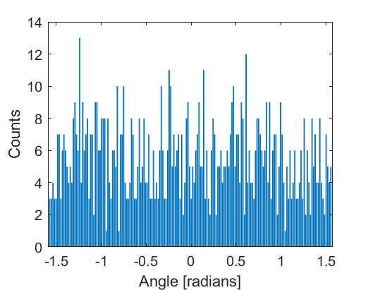

# circmean2

Calculates the 2D fiber statistics for entered circular values

---
---
&nbsp;

## Syntax

---

`meanDirection = circmean2(angles,magnitude)`

`[meanDirection, dv, stdev] = circmean2(angles,magnitude)`

---
---
&nbsp;

## Description

---

[meanDirection](#meandirection) = circmean2([angles](#angles), [magnitude](#magnitude)) returns the mean direction (meanDirection) based on a set of angles (angles) and magnitudes (magnitude).

[[meanDirection](#meandirection), [dv](#dv), [stdev](#stdev)] = circmean2( ___ ) outputs the directional variance (dv) and standard deviation (stdev) as well.

---
---
&nbsp;

## Examples

---

## **Calculate circular summary statistics**

Generate a random array of angles ranging between (-pi/2) and (pi/2)

```matlab
angs = rand(1,1000);
angs = (angs*pi)-(pi/2);
```

Visualize the data

```matlab
figure; bar((-pi/2:pi/180:pi/2-(pi/180)),histcounts(angs,(-pi/2:pi/180:pi/2)));
ylabel('Counts'); xlabel('Angle [radians]');
```



Calculate the (non-weighted) mean direction and directional variance

```matlab
[meanc,varc,~] = circmean2(angs,ones(size(angs)));
disp(['Mean Direction: ',num2str(meanc*(180/pi),3),' degrees.'])
disp(['Directional Variance: ',num2str(varc,3),'.'])
```

```matlab
Mean Direction: 166 degrees.
Directional Variance: 0.977.
```

---
---
&nbsp;

## Input Arguments

---

## angles

Array of angles, in radians.

*Data types: `single` | `double`*

## magnitude

Array of magnitudes for each angle ranging between 0-1.

*Data types: `single` | `double`*

---
---
&nbsp;

## Output Arguments

---

## meanDirection

Average direction of all input angles. If magnitude values are non-binary, then the output is a weighted average based on magnitude values.

*Data types: `single` | `double`*

## dv

Directional variance of all input angles.

*Data types: `single` | `double`*

## stdev

Standard deviation of all input angles.

*Data types: `single` | `double`*

---
---
&nbsp;

## More About

---

## *Circular mean*

To calculate the mean direction, the axial data (spanning over 180 degrees) must first be converted to circular data (spanning 360 degrees). The weighted average X ($\bar{C}$) and Y ($\bar{S}$) components can then be calculated:

$ \bar{C} = \sum_{i=1}^{n} {w_i * cos(2\theta_i)} $

$ \bar{S} = \sum_{i=1}^{n} {w_i * sin(2\theta_i)} $

Next, the mean direction ($\bar{\theta}$) can be calculated using `atan2`:

$\bar{\theta} = atan2(\bar{S},\bar{C})/2 $

&nbsp;

## *Directional Variance*

To calculate a directional variance, first the resultant length ($\bar{R}$) for all vectors must be calculated:

$ \bar{R} = \frac{\sqrt{\bar{C}^2 + \bar{S}^2 }} {\sum_{i=1}^{n} {w_i}}$

Then directional variance ($V$) can be calculated as:

$ V = 1 - \bar{R}  $

---
---

## [Return to top](#circmean2)
